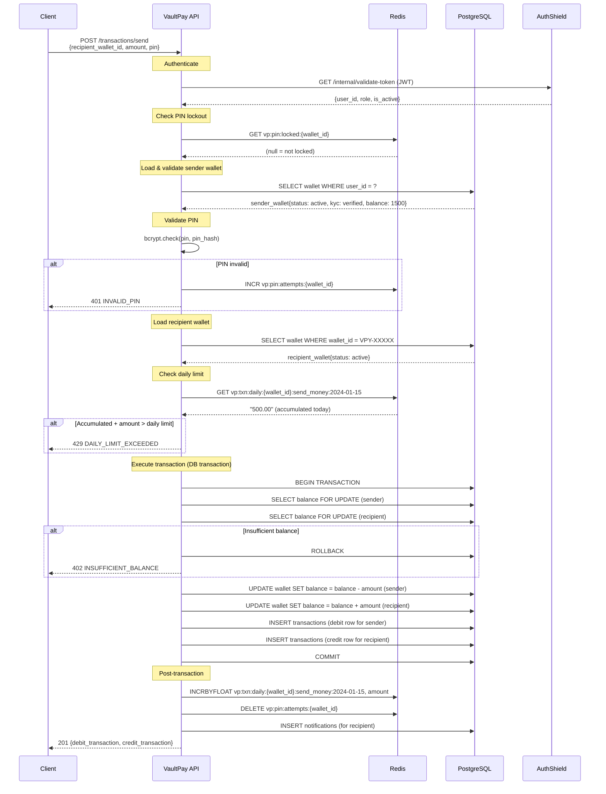
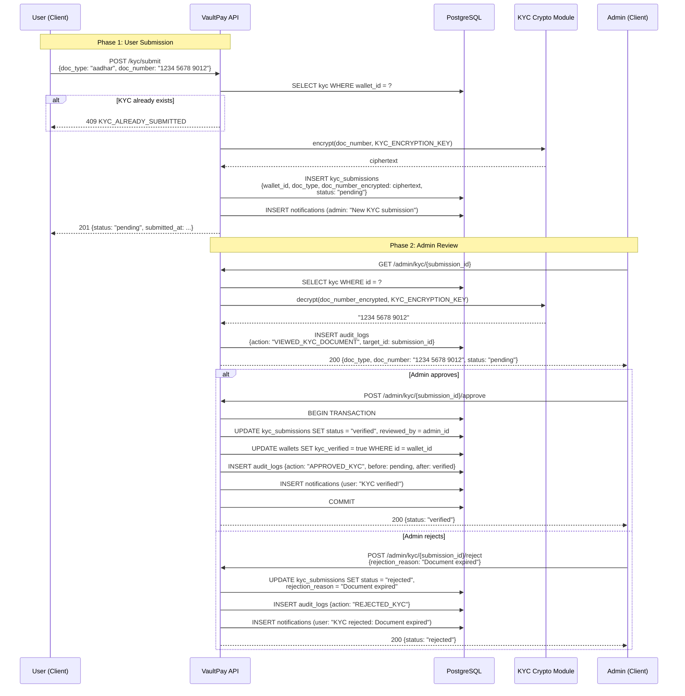
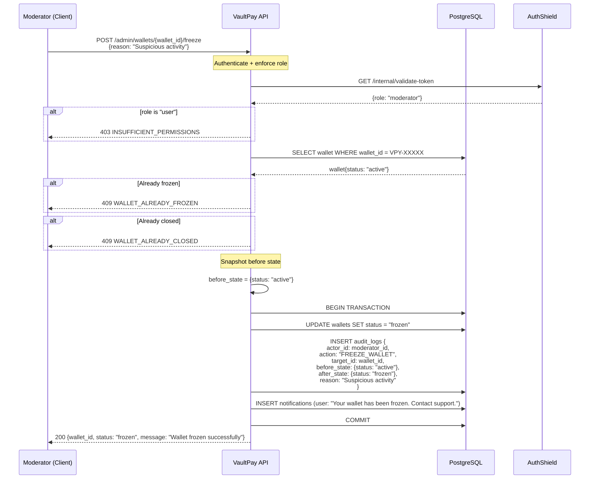

# Feature Flows

Detailed sequence diagrams for the 3 critical financial flows in VaultPay.

---

## 1. P2P Send Money

**Pre-conditions:** Both wallets active, sender KYC verified, PIN set

---

## 2. KYC Submission & Approval

**Two-phase flow**: User submits, Admin reviews

---

## 3. Admin Wallet Freeze

**Actor:** Moderator or Admin  
**Effect:** Wallet is frozen — all outgoing operations blocked

---

## Guard Conditions Summary

| Operation | Wallet Must Be | KYC | PIN | Balance Check |
|---|---|---|---|---|
| View balance | Any | No | No | No |
| Top up | Active | Yes | No | No |
| Send money | Active | Yes | Yes | Yes |
| Withdraw | Active | Yes | Yes | Yes |
| Freeze (self) | Active or Active | No | No | No |
| Unfreeze (self) | Frozen | No | No | No |
| Close wallet | Active | No | No | Zero balance |
| Admin freeze | Any non-closed | No | No | No |
