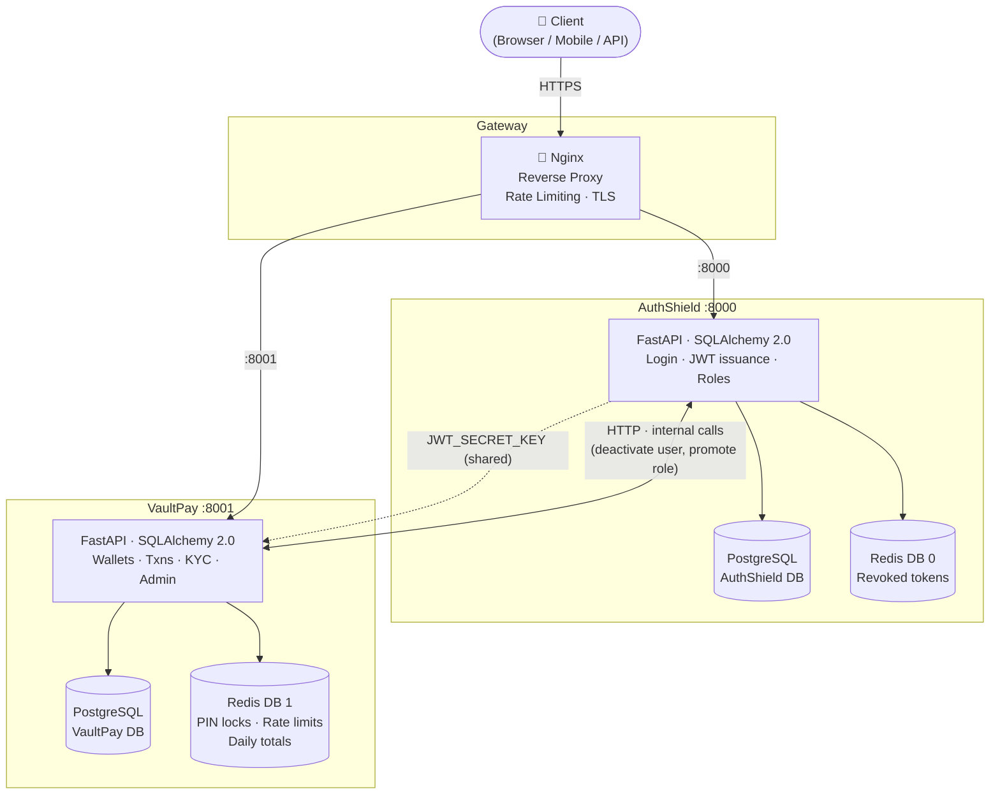

# System Architecture

## Overview

VaultPay is a **two-service microservices system**:

| Service | Port | Responsibility |
|---|---|---|
| **AuthShield** | 8000 | User accounts, login/logout, JWT issuance, role management |
| **VaultPay** | 8001 | Wallets, transactions, KYC, notifications, admin ops |

The services share **no database**. They communicate through two channels:
1. **JWT validation** — VaultPay validates tokens locally using the shared `JWT_SECRET_KEY`
2. **HTTP API calls (selective)** — VaultPay calls AuthShield only when it needs live user data or cross-service admin operations (e.g. deactivating a user's account)

---

## System Diagram



---

## JWT Authentication

VaultPay uses **dual-mode JWT validation**:

### Fast-Path (most endpoints)
VaultPay validates the JWT **locally** using the shared `JWT_SECRET_KEY`.
- No network call to AuthShield
- Reads claims: `user_id`, `email`, `roles`, `is_active`
- Raises `TokenExpiredError`, `TokenInvalidError`, or `AccountDisabledError` as appropriate
- **Tradeoff**: A user deactivated in AuthShield might still get one request through until their token expires

### Strict-Path (sensitive operations)
For high-stakes actions (e.g. super admin operations), VaultPay makes an HTTP call to AuthShield's `/users/me` endpoint to verify the token is still live.
- Catches mid-session deactivation
- Higher latency (~50ms round trip)

### Token Flow
```
1. User logs in → AuthShield issues JWT (HS256, expiry configurable)
2. Client includes: Authorization: Bearer <token>
3. VaultPay.RequestIDMiddleware adds X-Request-ID
4. VaultPay.get_current_user():
     a. Extract token from header
     b. Decode with PyJWT + shared secret
     c. Check: is_active, token_revoked (Redis DB 0 lookup)
     d. Return UserContext(user_id, email, roles)
5. Route handler receives UserContext and proceeds
```

---

## Role-Based Access Control (RBAC)

4-tier role hierarchy. Each role is a **superset** of the permissions below it.

```
super_admin
    ↑
  admin           (can call AuthShield admin APIs)
    ↑
moderator         (can review KYC, freeze wallets)
    ↑
  user            (base — create wallet, transact)
```

### Role Permissions Matrix

| Operation | user | moderator | admin | super_admin |
|---|:---:|:---:|:---:|:---:|
| Create & view own wallet | ✅ | ✅ | ✅ | ✅ |
| Send money, top up | ✅ | ✅ | ✅ | ✅ |
| Set / change PIN | ✅ | ✅ | ✅ | ✅ |
| Submit KYC | ✅ | ✅ | ✅ | ✅ |
| Review KYC submissions | ❌ | ✅ | ✅ | ✅ |
| Freeze / unfreeze any wallet | ❌ | ✅ | ✅ | ✅ |
| View all wallets and transactions | ❌ | ✅ | ✅ | ✅ |
| Edit transaction limits | ❌ | ❌ | ✅ | ✅ |
| Deactivate users (via AuthShield) | ❌ | ❌ | ✅ | ✅ |
| Create admin accounts | ❌ | ❌ | ❌ | ✅ |
| Access system stats | ❌ | ❌ | ❌ | ✅ |

### Implementation

Roles are enforced with FastAPI dependencies:

```python
# Example: moderator-or-above required
@router.get("/admin/kyc")
async def list_kyc_submissions(
    kyc_service: KYCService = Depends(get_kyc_service),
    user: UserContext = Depends(require_roles(["moderator", "admin", "super_admin"])),
):
    ...
```

The `require_roles()` dependency:
1. Calls `get_current_user()` to decode JWT
2. Checks `user.roles` against the allowed list
3. Raises `InsufficientPermissionsError` (403) if not satisfied

---

## Request Tracing

Every request carries an `X-Request-ID` header through the full chain:

```
Client → [X-Request-ID: generated or passed] → VaultPay → AuthShield
                                                    ↓
                                              audit_logs.request_id
                                              structured logs
                                              error response body
```

**RequestIDMiddleware** (registered in `main.py`) handles this:
- If client sends `X-Request-ID`: reuse it (supports API gateways and tracing systems)
- Otherwise: generate a new `uuid4()`
- Stored on `request.state.request_id` — accessible to all dependencies and handlers
- Echoed back in response headers

See [`code-samples/auth-middleware.py`](../code-samples/auth-middleware.py) for the implementation.

---

## Inter-Service Communication

VaultPay calls AuthShield via an `AuthShieldClient` (async `httpx.AsyncClient`):

```python
class AuthShieldClient:
    base_url: str  # AUTHSHIELD_BASE_URL from settings
    timeout: 10.0  # seconds

    async def get_user(self, user_id: UUID, token: str) -> AuthShieldUser: ...
    async def deactivate_user(self, user_id: UUID, admin_token: str) -> None: ...
    async def promote_user_role(self, user_id: UUID, role: str, admin_token: str) -> None: ...
```

The client raises `AuthShieldUnavailableError` on:
- `httpx.ConnectError` — AuthShield is down
- `httpx.TimeoutException` — response took > 10s
- Non-2xx status — propagated with context

---

## Transaction Safety

All financial mutations use **database transactions** to prevent partial updates:

```
send_money flow (simplified):
  BEGIN;
    SELECT sender_wallet FOR UPDATE;   -- lock sender row
    SELECT receiver_wallet FOR UPDATE; -- lock receiver row
    -- check: sender is active, not frozen
    -- check: receiver is active, not closed
    -- check: sender.balance >= amount
    UPDATE wallets SET balance = balance - amount WHERE id = sender.id;
    UPDATE wallets SET balance = balance + amount WHERE id = receiver.id;
    INSERT INTO transactions (type='debit', wallet_id=sender.id, ...);
    INSERT INTO transactions (type='credit', wallet_id=receiver.id, ...);
  COMMIT;
```

A `WalletFrozenError` raised **mid-transaction** will trigger ROLLBACK automatically via SQLAlchemy's async session context manager.

